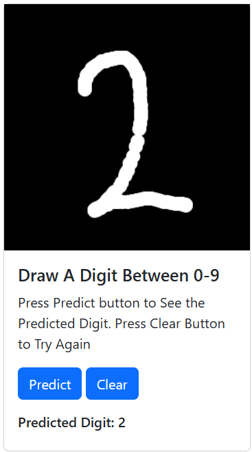

# Live Demo
### Please Check out the Live Demo of the web app: <u>**[Live Demo](https://mnist-classification-app-307727006026.us-east5.run.app)**</u>
 

# Overview
A simple web app that allows the user to write a digit between 0-9 and predicts what digit was written by the user. It uses a trained CNN modl that was trained on the famous MNIST dataset.  
 

# Technologies Used
- **Backend**: Flask
- **Programming Language**: Python
- **Machine Learning Toolkit**: Kubeflow
- **Cloud Hosting**: Google Cloud Platform (GCP)
 

# How It Works
Draw a digit between 0-9 on the black canvas. Press `Predict` button to see the prediction of the ML model. Press `Clear` button to try again.

